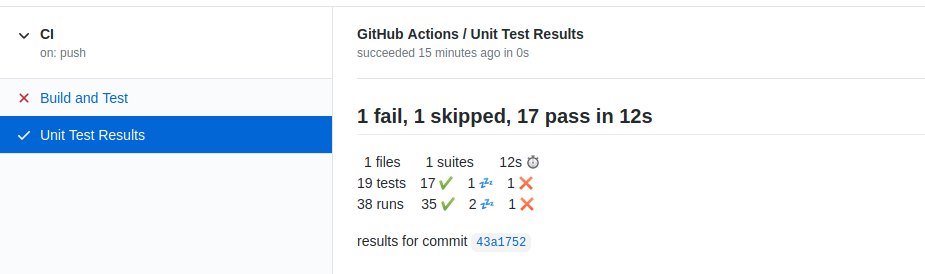
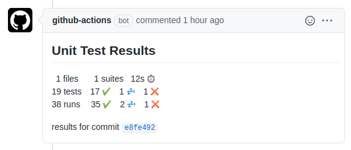
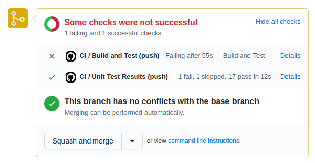
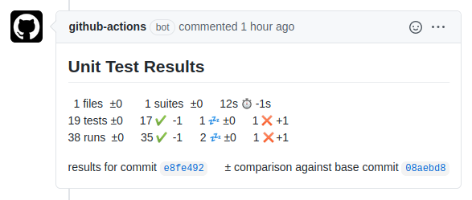

# GitHub Action to Publish Unit Test Results

This [GitHub Action](https://github.com/actions) analyses Unit Test result files and
publishes the results on GitHub. It supports the JUnit XML file format.

Unit test results are published in the GitHub Actions section of the respective commit:



***Note:** This action does not fail if unit tests failed. The action that executed the unit tests should
fail on test failure.*

A comment is posted on the pull request page of that commit, if one exists:



The checks section of the pull request also lists a short summary (here `1 fail, 1 skipped, 17 pass in 12s`),
and a link to the GitHub Actions section (here `Details`):



The result distinguishes between tests and runs. In some situations, tests run multiple times,
e.g. in different environments. Displaying the number of runs allows spotting unexpected
changes in the number of runs as well.

The symbols have the following meaning:

|Symbol|Meaning|
|:----:|-------|
||A successful test or run|
||A skipped test or run|
||A failed test or run|
||An erroneous test or run|
||The duration of all tests or runs|

When this action has been run on master, or earlier commits in the same branch, then this action
also compares unit test results across commits. This allows seeing changes in the number of tests and runs introduced by a given commit or pull request:



## Using this Action

You can add this action to your GitHub workflow on `push`, `pull_request`, and `pull_request_target` events
and configure it as follows:

```yaml
- name: Publish Unit Test Results
  uses: aiaibot/publish-unit-test-result@v1.0
  if: always()
  with:
    github_token: ${{ secrets.GITHUB_TOKEN }}
    check_name: Unit Test Results
    files: test-results/**/*.xml
    report_individual_runs: true
    deduplicate_classes_by_file_name: false
```

